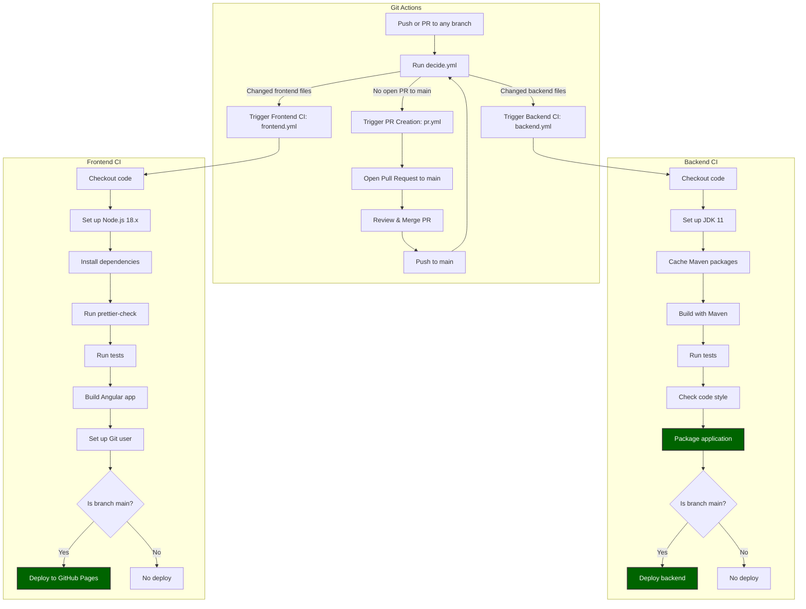

# Sistema_de_Moeda_Estudantil

## CI/CD Workflow

```mermaid
flowchart TD
    subgraph Git Actions
        A1[Push or PR to any branch] --> B1[Run decide.yml]
        B1 -->|Changed backend files| C1[Trigger Backend CI: backend.yml]
        B1 -->|Changed frontend files| C2[Trigger Frontend CI: frontend.yml]
        B1 -->|No open PR to main| C3[Trigger PR Creation: pr.yml]
        C3 --> D1[Open Pull Request to main]
        D1 --> E1[Review & Merge PR]
        E1 --> F1[Push to main]
        F1 --> B1
    end

    subgraph Backend CI
        C1 --> H1[Checkout code]
        H1 --> I1[Set up JDK 11]
        I1 --> J1[Cache Maven packages]
        J1 --> K1[Build with Maven]
        K1 --> L1[Run tests]
        L1 --> M1[Check code style]
        M1 --> N1[Package application]
        N1 --> O1{Is branch main?}
        O1 -- Yes --> P1[Deploy backend]
        O1 -- No --> Q1[No deploy]
    end

    subgraph Frontend CI
        C2 --> H2[Checkout code]
        H2 --> I2[Set up Node.js 18.x]
        I2 --> J2[Install dependencies]
        J2 --> K2[Run prettier-check]
        K2 --> L2[Run tests]
        L2 --> M2[Build Angular app]
        M2 --> N2[Set up Git user]
        N2 --> O2{Is branch main?}
        O2 -- Yes --> P2[Deploy to GitHub Pages]
        O2 -- No --> Q2[No deploy]
    end

    style P2 fill:#006400,stroke:#333,stroke-width:2px,color:#fff
    style N1 fill:#006400,stroke:#333,stroke-width:2px,color:#fff
    style P1 fill:#006400,stroke:#333,stroke-width:2px,color:#fff
```
